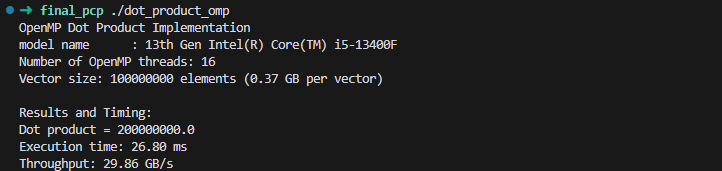
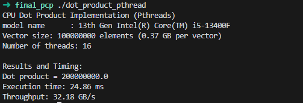
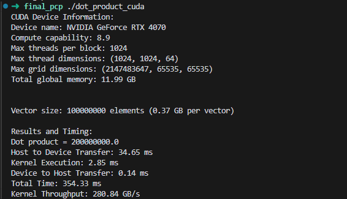
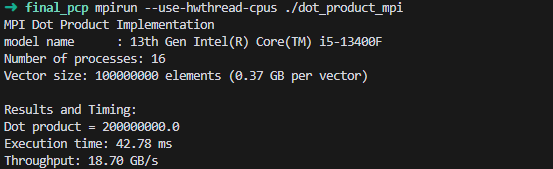
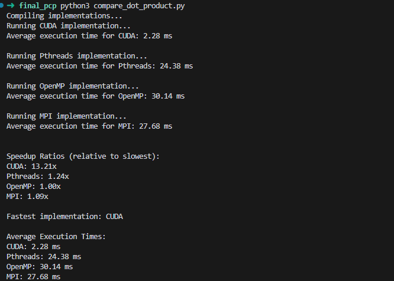

# Comparación de Desempeño del Producto Punto

Este proyecto compara el rendimiento de diferentes implementaciones paralelas de un cálculo de producto punto utilizando CUDA, Pthreads, OpenMP y MPI.

## Autor

- **Diego Andre Falla Gallegos**

## Especificaciones

- **CPU**: Intel(R) Core(TM) i5-13400F de 13ª generación
- **GPU**: NVIDIA GeForce RTX 4070
- **RAM**: 16GB DDR5

## Requisitos Previos

Antes de comenzar, asegúrate de tener instalado el siguiente software en tu sistema:

- **CUDA Toolkit**: Requerido para compilar y ejecutar la implementación en CUDA.
- **GCC**: Requerido para compilar las implementaciones de Pthreads y OpenMP.
- **OpenMPI**: Requerido para compilar y ejecutar la implementación en MPI.
- **Python 3**: Requerido para ejecutar el script de comparación.

## Instalación

### Linux

1. **Instalar CUDA Toolkit**:
   - Sigue las instrucciones en el [sitio web de NVIDIA](https://developer.nvidia.com/cuda-downloads) para instalar el CUDA Toolkit.

2. **Instalar GCC**:
   ```bash
   sudo apt update
   sudo apt install build-essential
   ```

3. **Instalar OpenMPI**:
   ```bash
   sudo apt install libopenmpi-dev openmpi-bin
   ```

4. **Instalar Python 3**:
   ```bash
   sudo apt install python3 python3-pip
   ```

## Compilation

Compile todas las implementaciones ejecutando los siguientes comandos:
```bash
nvcc dot_product.cu -o dot_product_cuda -O3
gcc -o dot_product_pthread dot_product_pthread.c -pthread -O3
gcc -o dot_product_omp dot_product_omp.c -fopenmp -O3
mpicc dot_product_mpi.c -o dot_product_mpi -O3
```

## Running the Comparison Script

Para ejecutar el script de comparación y ver los resultados de rendimiento, ejecuta el siguiente comando:

```bash
python3 compare_dot_product.py
```

Este script hará lo siguiente:
- Compilar cada implementación (si no está ya compilada).
- Ejecutar cada implementación 5 veces.
- Calcular y mostrar el tiempo de ejecución promedio para cada implementación.
- Mostrar los ratios de aceleración relativos a la implementación más lenta.
- Mostrar las salidas de cada implementación para todas las ejecuciones.

## Notes

- Asegúrate de que tu sistema tenga una GPU NVIDIA compatible para ejecutar la implementación en CUDA.
- Ajusta el número de procesos MPI en el script si es necesario, basado en la cantidad de núcleos de CPU de tu sistema.
- El script asume que todos los archivos fuente están en el mismo directorio que el script.

## Comparación









- **CUDA** es el más rápido en ejecución con 2.85ms, pero sumando el tiempo de transferencia de datos a la GPU y la ejecución del kernel, el tiempo total es de 354.33ms.
- **OpenMP** es el segundo más rápido con 24.86ms.
- **Pthreads** es el tercer más rápido con 26.80ms.
- **MPI** es el más lento con 42.78ms, aunque este se realizo solo en 1 nodo.

## Speedup

Gracias al script de comparación, podemos ver que el speedup de cada implementación (solo considerando el tiempo de ejecución) respecto a la más lenta, en base a la media de 5 ejecuciones de cada implementación. Los resultados son los siguientes:



## Conclusión

Como conclusión, podemos ver que la implementación en CUDA es la más rápida, pero su tiempo total de ejecución es mayor debido a la transferencia de datos a la GPU y la ejecución del kernel. Las implementaciones en Pthreads y OpenMP tienen tiempos de ejecución similares, pero ligeramente más lentas que CUDA. La implementación en MPI es significativamente más lenta, pero esto se debe a que solo se ejecutó en un nodo.
